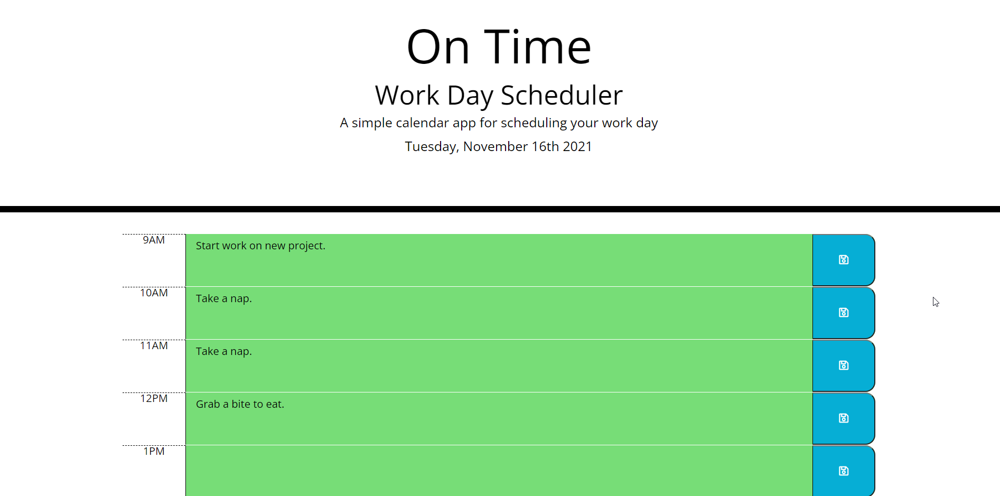

  # On Time
  

  ## Description
  A daily scheduler that provides hourly blocks to enter events. Color coding alerts the user to the urgency of the event. 

  ## Table of Contents
  * [Usage](#usage)
  * [Contributing](#contributing)
  
  ## Usage
  Creating a daily schedule.
  

  ## Contributing
  Stormblessed624

  ## Tests
  

  ## Questions?
  - Reach me at my email: matt.white.624@gmail.com
  - GitHub username: [Stormblessed624](https://github.com/Stormblessed624/)

  

